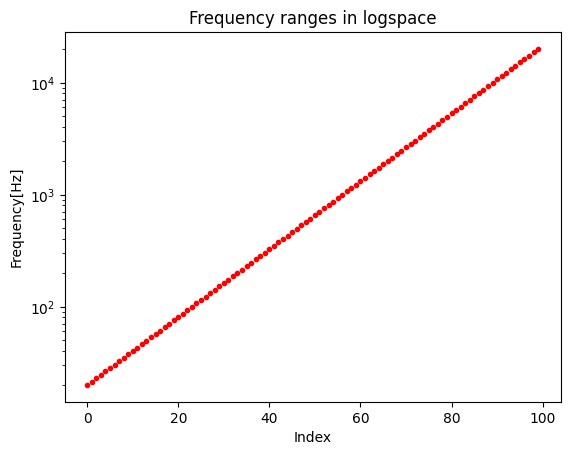
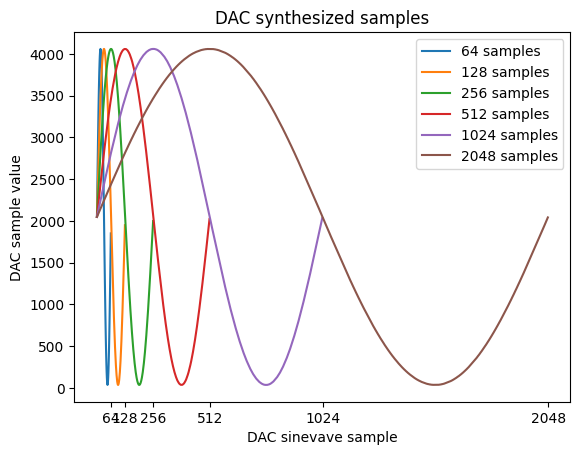
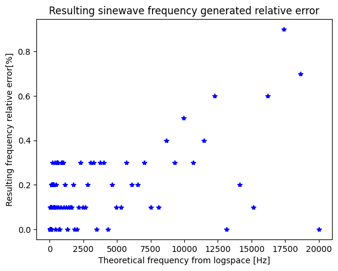
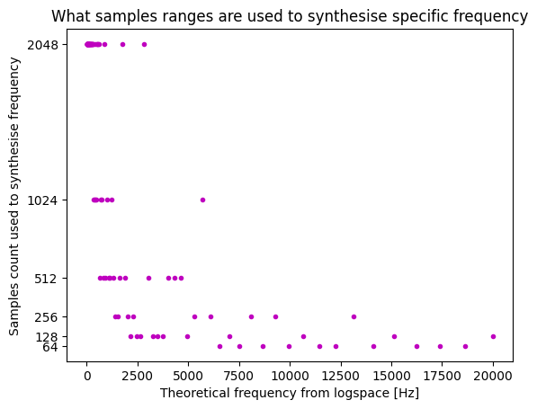
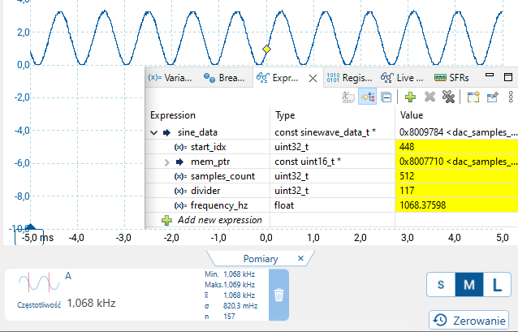

# FFTslice

Module to evaluate FFT. Communication with SPI. PGA for gain control. 2 selectable channels, additional DAC channel for selftest.

    

## DAC samples generation

See [notebook](Doc/DAC_samples/FFTSlice_DAC.ipynb) with all calculations. 

Frequencies from 20 Hz to 20 kHz are splitted into 100 ranges in logspace to better fit sound perception. 

    

3 variables affects output DAC frequency:
- constant TIM1 clock = 64 MHz,
- variable divider
- samples count

Divider can be freely changed, but samples count have to be generated in advance and stored in FLASH. There are 6 samples counts: 64, 128, 256, 512, 1024 and 2048. Higher samples counts fits better to generate low frequencies, lower samples counts are better fot higher frequencies.

    

100 parameters are calculated so that samples count and divider lowers time in which output voltage remain the same, and deviation from theoretical frequency is acceptable.

Resulting error remains below 1% as seen in the plot:

    

Matching of samples counts is more or less proportional:

    

Resulting frequencies are very close to theoretically calculated. In the plot sinewave with output buffer enabled without low pass filter:

    

